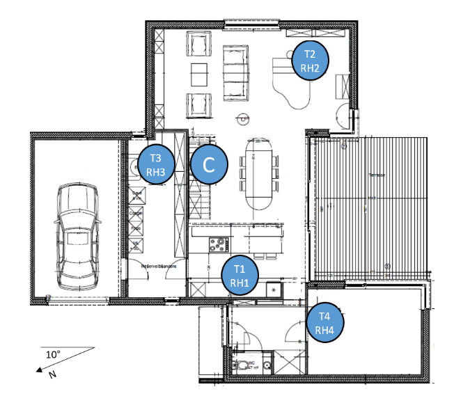
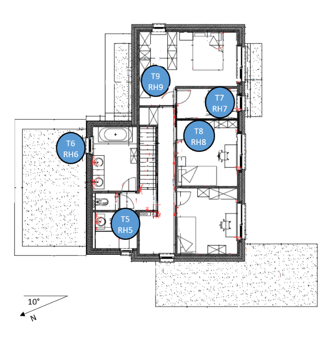

---
output:
  pdf_document: 
    toc: yes
  word_document:
    toc: yes
---

# Projeto 06 - Modelagem Preditiva Aplicada a IoT

Este projeto de IoT tem como objetivo a criação de modelos preditivos para a previsão de consumo de energia de eletrodoméstico. Os dados utilizados incluem medicões de sensores de temperatura e umidade de uma rede sem fio, previsão do tempo de uma estação de um aeroporto e uso de energia utilizada por luminárias.

Nesse projeto de aprendizado de máquina precisamos realizar a filtragem de dados para para revmover parâmtetros não preditivos e selecionar os melhores recursos para a previsão. O conjunto de dados foi coletado por um período de 10 minutos por cerca de 5 meses. As condições de temperatura e umidade da casa foram monitoradas com uma rede de sensores sem fio da ZigBee.

Cada nó sem fio transmistia as condições de temperatura e umidade em torno de 3 min. Em seguida, a média dos dados foi calculada para períodos de 10 minutos. Os dados de energia foram registrados a cada 10 minutos com medidores de energia de barramento "m". O tempo da estação meteorológica mais próxima do aeroporto (Aeroporto de Chievres, Bélgica) foi baixado de um conjunto de dados públiucos do Reliable Prognosis (rp5.ru) e mesclado com os conjuntos de dados experimentais usando a coluna de data e hora. Duas variáveis aleatórias foram incluídas no conjunto de dados para testar os modelos de regressão e filtar os atributos não preditivos (parâmetros).

Nosso trabalho agora é construir um modelo preditivo que possa prever o consumo de energia com base nos dados de sensores IoT coletados. Usaremos a linguagem R para a realização deste projeto.

Os dados podem ser baixados no link abaixo:

<https://www.kaggle.com/competitions/appliances-energy-prediction>

## Dicionário de Dados

-   **Appliances**, energia utilizada por eletrodomésticos em Wh
-   **lights**, energia utilizada pelas lampadas da casa em Wh
-   **T1**, Temperatura na área da Cozinha, em Celsius
-   **RH_1**, Umidade na área da Cozinha, em %
-   **T2**, Temperautura na área da Sala de Estar, em Celsius
-   **RH_2**, Umidade na área da Sala de Estar, em %
-   **T3**, Temperatura na área da Lavanderia, em Celsius
-   **RH_3**, Umidade na área da Lavanderia, em %
-   **T4**, Temperatura na área do Escritório, em Celsius
-   **RH_4**, Umidade na área do Escritório, em %
-   **T5**, Temperatura na área do Banheiro, em Celsius
-   **RH_5**, Umidade na área do Banheiro, em %
-   **T6**, Temperatura na área Externa (Lado Norte), em Celsius
-   **RH_6**, Umidade na área Externa (Lado Norte), em %
-   **T7**, Temperatura na área da Sala de Engomar, em Celsius
-   **RH_7**, Umidade na área da Sala de Engomar, em %
-   **T8**, Temperatura na área do Quarto Filhos, em Celsius
-   **RH_8**, Umidade na área do Quarto Filhos, em %
-   **T9**, Temperatura na área do Quarto Casal, em Celsius
-   **RH_9**, Umidade na área do Quarto Casal, em %
-   **To**, Temperatura Local (Medido da Estação Meteorológica de Chievres), em Celsius
-   **Pressure**, Pressão Atmosférica (Medido da Estação Meteorológica de Chievres), em mmHg
-   **RH_out**, Umidade Local (Medido da Estação Meteorológica de Chievres), em %
-   **Windspeed**, Velocidade do Vento (Medido da Estação Meteorológica de Chievres), em m/s
-   **Visibility**, Visibilidade (Medido da Estação Meteorológica de Chievres), em km
-   **Tdewpoint**, Temperatura de Condensação da Água ou Ponto de Orvalho (Medido da Estação Meteorológica de Chievres), em Celsius
-   **rv1**, Variável Aleatória Não Dimensional
-   **rv2**, Variável Aleatória Não Dimensional





## Carregando Pacotes

```{r}
# Pacotes
library(dplyr)
library(caret)
library(ggplot2)
library(tidyverse)
library(clock)
library(ggcorrplot)
library(patchwork)
library(randomForest)
library(caret)
library(outForest)
library(outliers)
library(conflicted)

# SetSeed
set.seed(42)
```

## Carregando os dados

```{r}
# Carga de dados para montar o Dataset
df <- read.csv('Dados/projeto8-training.csv', 
               sep = ',',
               header = TRUE)
```

## Limpeza e Organização dos Dados

```{r}
# Verificando o tamanho do nosso Dataset
dim(df)
```

```{r}
# Verificando o Tipo de Dados que o Interpretador aplicou
str(df)
```

Podemos perceber que temos algumas variáveis do tipo "CHR". A variável "date" deve ser do tipo data para que possamos, se necessário mais a frente, quebrar em dia, mes, ano, portanto vamos alterar seu tipo neste momento. As Variáveis "WeekStatus" e "Day_of_Week" vamos analisar seus valores unicos e aplicar o tipo fator.

```{r}
# Transformando Datas do Formato CHR para Date
df$date <- strptime(df$date,
                    format = "%Y-%m-%d %H:%M:%S")
```

```{r}
# Transformando Variáveis CHR para tipo Fator
df$WeekStatus <- as.factor(df$WeekStatus)
df$Day_of_week <- as.factor(df$Day_of_week)
```

Feita as adequações, vamos verificar se temos dados ausentes...

```{r}
# Somando as observações sem informação (NaN)
sum(is.na(df))
```

Por fim não temos valores ausentes em nosso dataset. Para finalizar, vamos remover a coluna "MSM" pois não temos descrição do que se trata a variável, portanto vamos considerá-la desnecessária.

```{r}
# Removendo MSM
df$NSM <- NULL
str(df)
```

Agora estamos prontos para iniciar a análise exploratória dos dados!

## Análise Exploratória dos Dados

Para iniciarmos, vamos analisar as Medidas Estatísticas Centrais de cada Variável.

```{r}
# Medidas Centrais
summary(df[1:29])
```

Vamos separar as Variáveis Numéricas das Variáveis Categóricas.

```{r}
# Variáveis Numéricas
colnames(df)[1:29]
N <- df[colnames(df)[1:29]]
```

```{r}
# Variáveis Categóricas
C <- df[colnames(df)[30:31]]
```

Separada as Variáveis, vamos analisar o comportamento de cada uma e identificar possíveis insights.

### Variáveis Numéricas

```{r}
# Histogramas das Variáveis Numéricas
for (i in 2:29){
  hist(N[, i], 
       xlab = colnames(N[i]),
       main = '')
  boxplot(N[, i],
          xlab = colnames(N[i]), 
          main = '')
}
```

Algumas observações interessantes:

-   As variáveis de Temperatura e Umidade possuem distribuícões muito semelhantes a normal, pois possuem valores de Média e Mediana muito próximos. Não vamos aplicar um teste de Shapiro para verificar a hipótese de normalidade pois não é relevante ao resultado de nossa modelagem preditiva a princípio.

-   As variáveis "r1" e "r2" são praticamente constantes dentro de nossas observações, claramente serão descartadas em nossa seleção de variáveis mais importantes.

-   A variável "lights" possue uma distribuição próxima a normal, porém vamos analisar melhor sua correlação com a variável resposta (Applience) visto que inicialmente são variáveis concorrentes e independentes entre si. Vamos confirmar analisando as correlações.

-   A variável Resposta (Applience) tem uma distribuição que se assemelha a Normal, porém possuimos alguns dados outliers, assim como a maioria das variáveis preeditoras. Vamos tratar esse tema mais adiante.

Vamos verificar como as variáveis se correlacionam.

```{r}
# Calculo de Correlação
N2 <- N[2:29]
MatCor <- cor(N2)
ggcorrplot(MatCor, 
           type = 'lower', 
           p.mat = cor_pmat(N2))
```

```{r}
# Avaliando Multicolinearidade entre Variáveis Preditoras
N3 <- N[2:29]
MatCor1 <- cor(N3)
HighCor <- findCorrelation(MatCor1, 
                           cutoff = 0.75)
N3Filtered <- N3[,-HighCor]
MatCor2 <- cor(N3Filtered)
ggcorrplot(MatCor2, 
           type = 'lower', 
           method = 'circle')
```

Alguns pontos nos chamam a atenção:

-   As variáveis rv1 e rv2, não possuem correlação com absolutamente nenhuma outra variável, pois como mencionamos anteriormente, são praticamente constantes e foram inseridas artificialmente em nossos dados pelo Kaggle.

-   Nossa Variável Resposta Appliances demonstra ter algumas correlações positivas e negativas leves com algumas de nossas variáveis. O que nos mostra que temos a possibilidade de resolver nosso problema com um modelo de estrutura linear.

-   A Variável Windspeed possuem alguma correlação, apesar de baixa, com a Temperatura do Quarto do Filho, Umidade do Quarto do Casal e Umidade Local, e ainda com a Pressão Atmof. do Local. tem pouca correlação ou nenhuma com nossos dados.

-   A Temperatura da Sala sofre forte influência negativa com a Umidade Local. A Umidade da Sala sofre forte influência positiva da Umidade Local. Provavelmente é uma área com janelas de ventilação.

-   A Umidade do Quarto do Casal possui influência positiva da Umidade Local.

Percebemos que a Variável lights é a única variável com correlação mais forte com a variável resposta.

Para finalizarmos nossa anáise das variáveis numéricas, vamos estudar como a variável resposta se comporta ao longo do tempo, utilizando a variável Date.

```{r message=FALSE, warning=FALSE}
# Tabela da Média de Appliances ao longo do Tempo
scat <- df %>% select(c(date, Appliances))
scat$date <- as.Date(scat$date)
scat <- scat %>% 
  group_by(date) %>% 
  summarise(Consumo = sum(Appliances))
head(scat)
```

```{r}
# Série temporal da Variável Appliances
ggplot(data = scat) + 
  geom_line(mapping = aes(x = date, y = Consumo)) +
  theme_minimal() +
  ggtitle('Comportamento da Variável Appliance ao Longo do Tempo') +
  labs(x = '', 
       y = 'Total do Cons. de Energia de Eletros - Wh') +
  geom_abline(aes(intercept = mean(Consumo), slope = 0), 
              color = 'red') +
  annotate(geom = 'text', 
           x = as.Date('2016-01-14'),
           y = 105, 
           label = 'Média do Período',
           size = 2.5, color = 'red')
```

Podemos pontuar a respeito:

-   O maior pico de consumo ocorreu em Abril, o dobro da média do período.

-   Como era de se esperar, dentro da janela de tempo de 1 mês temos uma volatilidade grande com valores mínimos entre 75 Wh e 150 Wh em sua grande maoria. Isso pode ocorrer porque alguns eletrodomésticos utilizam maior quantidade de energia mas não são usados com muita frequência, como Máquinas de Lavar e Secar, Ferros de Passar entre outros.

Como a Variável Appliances teve um comportamento diferente em Abril em relação aos outros meses, acredito que caiba uma análise temporal as demais variáveis para identificar comportamento semelhante.

```{r}
# Criando um dataset específico para Séries Temporais
dfst <- df

dfst$date <- as.Date(df$date)

dfst <- dfst %>%
  group_by(date) %>%
  summarise(T1 = mean(T1),
            RH_1 = mean(RH_1),
            T2 = mean(T2),
            RH_2 = mean(RH_2),
            T3 = mean(T3),
            RH_3 = mean(RH_3),
            T4 = mean(T4),
            RH_4 = mean(RH_4),
            T5 = mean(T5),
            RH_5 = mean(RH_5),
            T6 = mean(T6),
            RH_6 = mean(RH_6),
            T7 = mean(T7),
            RH_7 = mean(RH_7),
            T8 = mean(T8),
            RH_8 = mean(RH_8),
            T9 = mean(T9),
            RH_9 = mean(RH_9),
            T_out = mean(T_out),
            Press_mm_hg = mean(Press_mm_hg),
            RH_out = mean(RH_out),
            Windspeed = mean(Windspeed),
            Visibility = mean(Visibility),
            Tdewpoint = mean(Tdewpoint))

# Visualiza o Novo Dataset de Séries Temporais
head(dfst)
```

```{r}
summary(dfst[2:6])
```

```{r}
# Visualiza as Medidas Centrais
summary(dfst[7:11])
```

```{r}
# Visualiza as Medidas Centrais
summary(dfst[12:16])
```

```{r}
# Visualiza as Medidas Centrais
summary(dfst[17:21])
```

```{r}
# Visualiza as Medidas Centrais
summary(dfst[22:25])
```

```{r}
# Criando os Elementos Gráficos das Séries Temporais
T1 <- ggplot(data = dfst) + 
  geom_line(mapping = aes(x = date, y = T1)) +
  theme_minimal() + 
  labs(y = '', x = '', subtitle = 'Variável T1') + 
  geom_abline(aes(intercept = mean(T1), slope = 0), color = 'red') + 
  annotate(geom = 'text', 
           x = as.Date('2016-01-14'),
           y = (mean(dfst$T1) + 1),
           label = 'Média do Período',
           size = 2.5, 
           color = 'red')

RH1 <- ggplot(data = dfst) + 
  geom_line(mapping = aes(x = date, y = RH_1)) + 
  theme_minimal() + 
  labs(x = '', 
       y = '', 
       subtitle = 'Vaiável RH_1') + 
  geom_abline(aes(intercept = mean(RH_1), slope = 0), 
              color = 'red') + 
  annotate(geom = 'text', 
           x = as.Date('2016-01-14'), 
           y = (mean(dfst$RH_1) + 1), 
           label = 'Média do Período', 
           size = 2.5, 
           color = 'red')

T2 <- ggplot(data = dfst) + 
  geom_line(mapping = aes(x = date, y = T2)) + 
  theme_minimal() + 
  labs(x = '', 
       y = '', 
       subtitle = 'Vaiável T2') + 
  geom_abline(aes(intercept = mean(T2), slope = 0), 
              color = 'red') + 
  annotate(geom = 'text', 
           x = as.Date('2016-01-14'), 
           y = (mean(dfst$T2) + 1), 
           label = 'Média do Período', 
           size = 2.5, 
           color = 'red')

RH2 <- ggplot(data = dfst) + 
  geom_line(mapping = aes(x = date, y = RH_2)) + 
  theme_minimal() + 
  labs(x = '', 
       y = '', 
       subtitle = 'Vaiável RH_2') + 
  geom_abline(aes(intercept = mean(RH_2), slope = 0),
              color = 'red') + 
  annotate(geom = 'text',
           x = as.Date('2016-01-14'), 
           y = (mean(dfst$RH_2) + 1), 
           label = 'Média do Período', 
           size = 2.5, 
           color = 'red')

T3 <- ggplot(data = dfst) + 
  geom_line(mapping = aes(x = date, y = T3)) + 
  theme_minimal() + 
  labs(x = '', 
       y = '', 
       subtitle = 'Vaiável T3') + 
  geom_abline(aes(intercept = mean(T3), slope = 0), 
              color = 'red') + 
  annotate(geom = 'text', 
           x = as.Date('2016-01-14'), 
           y = (mean(dfst$T3) + 1), 
           label = 'Média do Período', 
           size = 2.5, 
           color = 'red')

RH3 <- ggplot(data = dfst) + 
  geom_line(mapping = aes(x = date, y = RH_3)) + 
  theme_minimal() + 
  labs(x = '', 
       y = '', 
       subtitle = 'Vaiável RH_3') + 
  geom_abline(aes(intercept = mean(RH_3), slope = 0), 
              color = 'red') + 
  annotate(geom = 'text', 
           x = as.Date('2016-01-14'), 
           y = (mean(dfst$RH_3) + 1), 
           label = 'Média do Período', 
           size = 2.5, 
           color = 'red')

T4 <- ggplot(data = dfst) + 
  geom_line(mapping = aes(x = date, y = T4)) + 
  theme_minimal() + 
  labs(x = '', 
       y = '', 
       subtitle = 'Vaiável T4') + 
  geom_abline(aes(intercept = mean(T4), slope = 0), 
              color = 'red') + 
  annotate(geom = 'text', 
           x = as.Date('2016-01-14'), 
           y = (mean(dfst$T4) + 1), 
           label = 'Média do Período', 
           size = 2.5, 
           color = 'red')

RH4 <- ggplot(data = dfst) + 
  geom_line(mapping = aes(x = date, y = RH_4)) + 
  theme_minimal() + 
  labs(x = '', 
       y = '', 
       subtitle = 'Vaiável RH_4') + 
  geom_abline(aes(intercept = mean(RH_4), slope = 0), 
              color = 'red') + 
  annotate(geom = 'text', 
           x = as.Date('2016-01-14'), 
           y = (mean(dfst$RH_4) + 1), 
           label = 'Média do Período', 
           size = 2.5, 
           color = 'red')

T5 <- ggplot(data = dfst) + 
  geom_line(mapping = aes(x = date, y = T5)) + 
  theme_minimal() + 
  labs(x = '', 
       y = '', 
       subtitle = 'Vaiável T5') + 
  geom_abline(aes(intercept = mean(T5), slope = 0), 
              color = 'red') + 
  annotate(geom = 'text', 
           x = as.Date('2016-01-14'), 
           y = (mean(dfst$T5) + 1), 
           label = 'Média do Período', 
           size = 2.5, 
           color = 'red')

RH5 <- ggplot(data = dfst) + 
  geom_line(mapping = aes(x = date, y = RH_5)) + 
  theme_minimal() + 
  labs(x = '', 
       y = '', 
       subtitle = 'Vaiável RH_5') + 
  geom_abline(aes(intercept = mean(RH_5), slope = 0), 
              color = 'red') + 
  annotate(geom = 'text', 
           x = as.Date('2016-01-14'), 
           y = (mean(dfst$RH_5) + 1), 
           label = 'Média do Período', 
           size = 2.5, 
           color = 'red')

T6 <- ggplot(data = dfst) + 
  geom_line(mapping = aes(x = date, y = T6)) + 
  theme_minimal() + 
  labs(x = '', 
       y = '', 
       subtitle = 'Vaiável T6') + 
  geom_abline(aes(intercept = mean(T6), slope = 0), 
              color = 'red') + 
  annotate(geom = 'text', 
           x = as.Date('2016-01-14'),
           y = (mean(dfst$T6) + 3), 
           label = 'Média do Período', 
           size = 2.5, 
           color = 'red')

RH6 <- ggplot(data = dfst) + 
  geom_line(mapping = aes(x = date, y = RH_6)) + 
  theme_minimal() + 
  labs(x = '', 
       y = '', 
       subtitle = 'Vaiável RH_6') + 
  geom_abline(aes(intercept = mean(RH_6), slope = 0), 
              color = 'red') + 
  annotate(geom = 'text', 
           x = as.Date('2016-01-14'),
           y = (mean(dfst$RH_6) + 6), 
           label = 'Média do Período',
           size = 2.5, 
           color = 'red')

T7 <- ggplot(data = dfst) + 
  geom_line(mapping = aes(x = date, y = T7)) + 
  theme_minimal() + 
  labs(x = '', 
       y = '', 
       subtitle = 'Vaiável T7') + 
  geom_abline(aes(intercept = mean(T7), slope = 0), 
              color = 'red') + 
  annotate(geom = 'text',
           x = as.Date('2016-01-14'), 
           y = (mean(dfst$T7) + 1), 
           label = 'Média do Período', 
           size = 2.5, 
           color = 'red')

RH7 <- ggplot(data = dfst) + 
  geom_line(mapping = aes(x = date, y = RH_7)) + 
  theme_minimal() + 
  labs(x = '', 
       y = '', 
       subtitle = 'Vaiável RH_7') + 
  geom_abline(aes(intercept = mean(RH_7), slope = 0), 
              color = 'red') + 
  annotate(geom = 'text', 
           x = as.Date('2016-01-14'), 
           y = (mean(dfst$RH_7) + 1), 
           label = 'Média do Período', 
           size = 2.5, 
           color = 'red')

T8 <- ggplot(data = dfst) + 
  geom_line(mapping = aes(x = date, y = T8)) + 
  theme_minimal() + 
  labs(x = '', 
       y = '', 
       subtitle = 'Vaiável T8') + 
  geom_abline(aes(intercept = mean(T8), slope = 0), 
              color = 'red') + 
  annotate(geom = 'text', 
           x = as.Date('2016-01-14'), 
           y = (mean(dfst$T8) + 1),
           label = 'Média do Período', 
           size = 2.5, 
           color = 'red')

RH8 <- ggplot(data = dfst) + 
  geom_line(mapping = aes(x = date, y = RH_8)) + 
  theme_minimal() + 
  labs(x = '', 
       y = '',
       subtitle = 'Vaiável RH_8') + 
  geom_abline(aes(intercept = mean(RH_8), slope = 0), 
              color = 'red') +
  annotate(geom = 'text', 
           x = as.Date('2016-01-14'), 
           y = (mean(dfst$RH_8) + 1), 
           label = 'Média do Período', 
           size = 2.5, 
           color = 'red')

T9 <- ggplot(data = dfst) + 
  geom_line(mapping = aes(x = date, y = T9)) + 
  theme_minimal() + 
  labs(x = '', 
       y = '', 
       subtitle = 'Vaiável T9') + 
  geom_abline(aes(intercept = mean(T9), slope = 0), 
              color = 'red') + 
  annotate(geom = 'text', 
           x = as.Date('2016-01-14'), 
           y = (mean(dfst$T9) + 1), 
           label = 'Média do Período',
           size = 2.5, 
           color = 'red')

RH9 <- ggplot(data = dfst) + 
  geom_line(mapping = aes(x = date, y = RH_9)) +
  theme_minimal() + 
  labs(x = '', 
       y = '', 
       subtitle = 'Vaiável RH_9') + 
  geom_abline(aes(intercept = mean(RH_9), slope = 0), 
              color = 'red') + 
  annotate(geom = 'text', 
           x = as.Date('2016-01-14'), 
           y = (mean(dfst$RH_9) + 1), 
           label = 'Média do Período', 
           size = 2.5, 
           color = 'red')

Tout <- ggplot(data = dfst) + 
  geom_line(mapping = aes(x = date, y = T_out)) + 
  theme_minimal() + 
  labs(x = '',
       y = '', 
       subtitle = 'Vaiável T_out') + 
  geom_abline(aes(intercept = mean(T_out), slope = 0), 
              color = 'red') + 
  annotate(geom = 'text',
           x = as.Date('2016-01-14'), 
           y = (mean(dfst$T_out) + 3), 
           label = 'Média do Período', 
           size = 2.5, 
           color = 'red')

RHout <- ggplot(data = dfst) + 
  geom_line(mapping = aes(x = date, y = RH_out)) +
  theme_minimal() + 
  labs(x = '', 
       y = '', 
       subtitle = 'Vaiável RH_out') +
  geom_abline(aes(intercept = mean(RH_out), slope = 0), 
              color = 'red') + 
  annotate(geom = 'text', 
           x = as.Date('2016-01-14'), 
           y = (mean(dfst$RH_out) + 3),
           label = 'Média do Período', 
           size = 2.5, 
           color = 'red')

Press <- ggplot(data = dfst) + 
  geom_line(mapping = aes(x = date, y = Press_mm_hg)) + 
  theme_minimal() + 
  labs(x = '', 
       y = '', 
       subtitle = 'Vaiável Press_mm_hg') + 
  geom_abline(aes(intercept = mean(Press_mm_hg), slope = 0), 
              color = 'red') + 
  annotate(geom = 'text', 
           x = as.Date('2016-01-14'), 
           y = (mean(dfst$Press_mm_hg) + 10), 
           label = 'Média do Período', 
           size = 2.5, 
           color = 'red')

Wind <- ggplot(data = dfst) + 
  geom_line(mapping = aes(x = date, y = Windspeed)) + 
  theme_minimal() + 
  labs(x = '', 
       y = '', 
       subtitle = 'Vaiável Windspeed') + 
  geom_abline(aes(intercept = mean(Windspeed), slope = 0), 
              color = 'red') + 
  annotate(geom = 'text', 
           x = as.Date('2016-01-14'), 
           y = (mean(dfst$Windspeed) + 1), 
           label = 'Média do Período', 
           size = 2.5, 
           color = 'red')

Visibility <- ggplot(data = dfst) + 
  geom_line(mapping = aes(x = date, y = Visibility)) + 
  theme_minimal() + 
  labs(x = '', 
       y = '', 
       subtitle = 'Vaiável Visibility') + 
  geom_abline(aes(intercept = mean(Visibility), slope = 0), 
              color = 'red') + 
  annotate(geom = 'text', 
           x = as.Date('2016-01-14'), 
           y = (mean(dfst$Visibility) + 5), 
           label = 'Média do Período', 
           size = 2.5, 
           color = 'red')

Tdew <- ggplot(data = dfst) + 
  geom_line(mapping = aes(x = date, y = Tdewpoint)) + 
  theme_minimal() + 
  labs(x = '', 
       y = '', 
       subtitle = 'Vaiável Tdewpoint') + 
  geom_abline(aes(intercept = mean(Tdewpoint), slope = 0), 
              color = 'red') + 
  annotate(geom = 'text', 
           x = as.Date('2016-01-14'), 
           y = (mean(dfst$Tdewpoint) + 5), 
           label = 'Média do Período', 
           size = 2.5, 
           color = 'red')
```

Vamos visualizar as Séries Temporais para cada Região da Casa e avaliar se temos em cada caso, alguma relação como tempo.

```{r}
# Região 01 - Cozinha
T1 / RH1
```

A umidade tem uma volatilidade maior em relação a Temperatura, o que é plausível, visto a época de chuvas. Temos um período de Maio a Junho com temperaturas mais altas e mais estáveis, porém com umidade mais volátil variando entre 36% e 52%. Ambas possuem tendência de alta de Maio para Junho.

```{r}
# Região 02 - Sala de Estar
T2 / RH2
```

Temos um comportamento bastante semelhante a região 01, com maio e junho trazendo uma tendência de alta.

```{r}
# Região 03 - Lavanderia
T3 / RH3
```

Na Lavanderia temos um cenário um pouco diferente. A temperatura em todo o Período tem uma tendência de crescimento, enquanto a umidade tem uma tendência de queda. Muitos fatores podem explicar esse comportamento, como exposição ao Sol, Sol matutino ou Vespertino, uso frequente dos equipamentos que podem gerar calor como máquina de lavar, secadora entre outros equipamentos comuns. Das regiões analisadas até o momento, é a que possuem minimos e máximos menores de umidade.

```{r}
# Região 04 - Escritório
T4 / RH4
```

Temos para o Escritório comportamento semelhante as demais regiões, no geral uma tendência de queda da umidade e aumento da temperatura. Caracteriza também a janela de maio-junho como tendo comportamento semelhante as demais regiões.

```{r}
# Região 05 - Banheiro
T5 / RH5
```

No banheiro temos oscilações de umidade de amplitudes maiores, o que nao parece incomum, visto o uso para banho por exemplo. No mais temos um comportamento semelhante ao restante dos ambientes que estudamos.

```{r}
# Região 06 - Área Externa do Segundo Andar
T6 / RH6
```

Para a área externa, temos um comportamento diferente quanto a umidade do período de maio e junho. Temos uma tendência de queda bastante incisiva, enquanto a temperatura em tendência de alta como nos demais ambientes. Os valores de Umidade também são bem maiores que no restante da casa, assim como as temperaturas são bem mais baixas.

```{r}
# Região 07 - Sala de Passar Roupa / Engomar
T7 / RH7
```

Podemos ver durante o período de maio-junho uma tendência de alta tanto para umidade quanto para temperatura. Nos períodos anteriores, o gráfico mostra uma tendência de queda para a umidade e alta para temperatura.

```{r}
# Região 08 - Quarto Filhos
T8 / RH8
```

Comportamento semelhante aos outros ambientes da casa, com exceção da área externa (região 6).

```{r}
# Região 09 - Quarto Casal
T9 / RH9
```

Novamente temos o mesmo padrão de outros ambientes. porém apesar da temperatura no geral ter uma tendência de alta, as oscilações no quarto do Casal são menos agressivas que nos demais ambientes.

```{r}
# Temperatura e Umidade no Local na Estação de Medição
Tout / RHout

```

Podemos perceber que as temperaturas na estação são muito menores que na casa, provavelmente pela calefação ou mesmo por ser uma área mais fechada que a externa. Já a umidade atinge valores muito mais altos com média de 80%.

```{r}
# Pressão Atmof e Velocidade do Vento na Estação
Press / Wind
```

Apesar da volatilidade da Pressão, nao temos tendência de alta ou baixa. A variação é de +- 15 mm hg o que podemos dizer que é praticamente constante no período.

Quanto a Velocidade do Vento, temos uma tendência de queda que talvez possa corroborar com algumas hipóteses do aumento do consumo de energia pelos eletrodomésticos.

```{r}
# Visibilidade e Ponto de Orvalho na Estação
Visibility / Tdew
```

A visibilidade oscila sobre a média em +- 10km ao longo de todo o período, sem tendência de aumento ou queda.

O ponto de orvalho sobe com o aumento da temperatura ambiente.

Por fim, uma teoria que podemos desenvolver, porém seria necessário mais informações para corroborar, seria que de abril em diante, os gráficos de temperatura passam a ser mais positivos em relação as suas médias. Eletrodomésticos como Ar condicionado, ventiladores, Churrasqueiras eletricas, são mais utilizados. As pessoas tendem a sair com mais frequência de suas casas, utilizam mais roupas, necessitando de maior frequência de uso de máquinas de lavar, secar e ferros de passar. Também se arrumam mais, aumento o uso de secadores de cabelo, chapinhas e etc.

Por fim, analisando comportamento das pessoas e pesquisando sobre a região de Chievre, entendemos que o período de Abril a Junho é o início das temperaturas mais agradáveis, momento esperado pelos habitantes, consequentemente corrobora com as suposições que criamos acima. Portando a mudança do Clima e estação em Chievre pode ajudar a explicar porque temos um pico de consumo de energia em eletrodomésticos em Abril e então uma tendência de alta a partir deste período.

### Variáveis Categóricas

Para as variáveis Categóricas, temos janelas de tempo menores, como Workdays e Weekends, assim como os 7 dias da semana. Poderíamos analisar o comportamento de cada variável para estas janelas de tempo, mas para o nosso modelo e compreensão dos dados não se faz necessário. Porém vamos estudar como as variáveis se comportam nestes dias em média.

```{r}
# Calculo de Médias das Variáveis por Tipo de WorkStatus
dfws <- df[2:31] %>% 
  group_by(WeekStatus) %>% 
  summarise(App = sum(Appliances)/1000, Lights = sum(lights)/1000)

dfws[1,2:3] = (dfws[1,2:3]) / 5
dfws[2, 2:3] = (dfws[2, 2:3]) / 2
```

```{r}
# Visualizando a Tabela
dfws
```

Podemos perceber claramente que não existe um consumo de energia nos eletrodoméstico significativamente maior entre Dias da Semana e Finais de Semana. Para as luzes o consumo ao longo da semana é maior que aos fins de semana. Provalvelmente pela cultura de deixar luzes acesas ao sair de casa.

```{r}
# Calculo de Médias das Variáveis por Tipo de WorkStatus
dfdow <- df[2:31] %>% 
  group_by(Day_of_week) %>% 
  summarise(App = sum(Appliances), Lights = sum(lights))
```

```{r}
# Visualizando a Tabela
dfdow
```

Podemos ver aqui um comportamento no uso dos eletrodomésticos, visto que de sexta-feira a segunda-feira, temos os maiores consumos. Em compensação o consumo de energia elétrica pelas luzes é claramente superior na maioria dos dias da semana, chegando a dobrar em alguns casos.

O fato curioso é o consumo de energia das luzes ser muito baixo nas sexta-feiras e Sabados, metade em relação aos demais dias. Um pico na Segunda-feira também se destaca.

## Pré-Processamento dos Dados

Para preparar nossos dados vamos desconsiderar a janela de tempo da variável 'date', pois nosso objetivo não é realizar modelagem preditiva de série temporal. Porém vamos manter as variáveis 'WeekStatus' e 'Day_of_Week' pois retratam uma janela estática, com possível influência na variável resposta. Sendo as variáveis do tipo cartegóricas, é importante fatorizá-las.

Também vamos dropar a variável 'lights' pois se trata de uma variável de consumo de energia e não possui relação com a variável resposta 'Appliances'.

Ainda precisamos reduzir a dimensionalidade e aplicar uma Padronização nos Dados para igualar as escalas e evitar que nosso modelo fique tendencioso e não generalizável.

```{r}
# Criando um novo Dataset
dfo <- df[2:31]
```

```{r}
# Conferindo os Tipos de Variáveis
str(dfo)
```

Como podemos verificar, as variáveis categóricas já são do tipo Fator, o que facilita nosso trabalho para Label Encoder.

```{r}
# Label Encoding das Variáveis Categóricas
dfo$WeekStatus <- as.numeric(dfo$WeekStatus)
dfo$Day_of_week <- as.numeric(dfo$Day_of_week)
unique(dfo$Day_of_week)
```

Lembrando que a semana começa por Sunday (Domingo) sendo este o número 1, seguido pelos demais dias da semana em sequencia ( Seg - 2, Ter-3, Qua - 4, Qui - 5, Sex - 6, Sab - 7).

```{r}
# Retirando os Outliers com OutForest
x <- outForest(dfo, replace = 'predictions', threshold = 0.05)
dffinal <- x$Data
```

```{r}
# Dividindo os dados em Treino e Teste
part <- createDataPartition(dffinal$Appliances, 
                            p = 0.75, 
                            list = FALSE)
training <- dffinal[part, ]
test <- dffinal[-part, ]
```

Dados divididos!

Agora vamos trabalhar na Seleção de Variáveis, utilizando o modelo Random Forest. Assim reduzimos a dimensionalidade e complexidade do Modelo Final.

```{r}
# Features Selection - Random Forest
modelo <- randomForest(Appliances ~ ., 
                       data = training, 
                       ntree = 100, 
                       nodesize = 3,
                       importance = TRUE)
```

```{r}
# Plotando as Variáveis mais Importantes
varImpPlot(modelo)
```

> No intuito de reduzir a complexidade do nosso modelo, vamos trabalhar com as 10 variáveis mais importantes apenas. Dessa forma nosso modelo fica menos complexo e mais generalizável.

```{r}
# Corrigindo o Dataset Final apenas com as Var Mais Importantes
training1 <- as.data.frame(training) %>% select(c(lights,
                                                  Press_mm_hg,
                                                  Day_of_week,
                                                  RH_3,
                                                  RH_out,
                                                  Visibility,
                                                  T8,
                                                  T5,
                                                  Windspeed,
                                                  RH_1,
                                                  Appliances))

test1 <- as.data.frame(test) %>% select(c(lights,
                                          Press_mm_hg,
                                          Day_of_week,
                                          RH_3,
                                          RH_out,
                                          Visibility,
                                          T8,
                                          T5,
                                          Windspeed,
                                          RH_1,
                                          Appliances))
```

## Modelagem Preditiva

Faremos uso de diferentes algoritmos para criar algumas versões de Modelos e analisar suas métricas de performance. Repare que estamos aplicando uma padronização nas variáveis preditoras, usando o argumento preProcess dentro da função train.

```{r}
# Modelo de Regressão com Gradiente Boosting
fitControl <- trainControl(method = 'repeatedcv',
                           number = 20,
                           search = 'grid')

GradientBoosting <- train(Appliances ~ .,
                          data = training1,
                          method = 'xgbLinear',
                          metric = 'RMSE',
                          maximize = FALSE,
                          trControl = fitControl,
                          preProcess = c('center', 'scale'))

GradientBoosting
```

```{r}
# Realizando as previsões e Calculando as Métricas
predGradientB <- predict(GradientBoosting, test1[,-11])
postResample(pred = predGradientB, obs = test1$Appliances)
```

```{r}
# Modelo de Regressão com Support Vector Machine
fitControl <- trainControl(method = 'repeatedcv',
                           number = 20,
                           search = 'grid')

SVM_Linear <- train(Appliances ~ .,
                    data = training1,
                    method = 'svmLinear2',
                    metric = 'RMSE',
                    maximize = FALSE,
                    preProcess = c('center', 'scale'))

SVM_Linear
```

```{r}
# Realizando as previsões e Calculando as Métricas
predSVM <- predict(SVM_Linear, test1[,-11])
postResample(pred = predSVM, obs = test1$Appliances)
```

```{r}
# Modelo de Regressão com Logistic Regression
fitControl <- trainControl(method = 'repeatedcv',
                           number = 20,
                           search = 'grid')

LogisticReg <- train(Appliances ~ .,
                     data = training1,
                     method = 'glm',
                     metric = 'RMSE',
                     maximize = FALSE,
                     preProcess = c('center', 'scale'))

LogisticReg
```

```{r}
# Realizando as previsões e Calculando as Métricas
predGLM <- predict(LogisticReg, test1[,-11])
postResample(pred = predGLM, obs = test1$Appliances)
```

Podemos verificar que o modelo eXtreme Gradient Boosting teve uma performance melhor, visto que o RSME e o MAE demonstram valores menores, alem de termos um R² bem mais eficiente com 82% de explicabilidade das variáveis preditoras em relação a variável resposta.

Sendo assim, vamos analisar um comparativo gráfico dos valores previstos e valores reais de teste.

```{r}
# Comparando os Valores Previstos x Valores Reais
nomescol <- c('ID', 'Valores_Reais', 'Valores_Previstos')
idcol <- c(1:length(predGradientB))
comp <- cbind(idcol, 
              (as.data.frame(test1$Appliances)), 
              (as.data.frame(predGradientB)))
colnames(comp) <- nomescol

head(comp)
```

```{r message=FALSE, warning=FALSE}
# Criando Gráfico de Comparação
ggplot(comp) + 
  geom_smooth(aes(x = ID, y = Valores_Reais),
              color = 'red', 
              show.legend = 'TRUE') + 
  geom_smooth(aes(x = ID, y = Valores_Previstos), 
              color = 'blue', 
              show.legend = TRUE) +
  labs(y = 'Consumo de Energia', 
       x = '', 
       subtitle = 'Comparativo Real x Previsto') +
  annotate(geom = 'text',
           x = 3700, 
           y = 113, 
           label = 'Previsão', 
           color = 'red', 
           size = 2.5) +
  annotate(geom = 'text',
           x = 3700, 
           y = 103, 
           label = 'Real', 
           color = 'blue', 
           size = 2.5)
```

## Deploy do Melhor Modelo

Finalizamos nosso projeto aplicando novos dados ao nosso modelo e entregando as previsões. Normalmente os dados aplicados no Deploy não possuem os valores reais que queremos prever, porém neste caso a Variável resposta se encontra presente, então vamos utilizar para avaliar como o modelo se comportou, comparando as Métricas RMSE, R² e MAE entre Previsto e Real.

```{r}
# Carregando novos dados
dfd <- read.csv('Dados/projeto8-testing.csv', sep = ',')

# Visualizando os dados
head(dfd)
```

```{r}
# Preparando os Dados para o Modelo
dfd$date <- NULL
dfd$NSM <- NULL
dfd$Day_of_week <- as.numeric(as.factor(dfd$Day_of_week))
dfd$WeekStatus <- as.numeric(as.factor(dfd$WeekStatus))

# Tratando os Outliers
dfd <- outForest(dfd, 
                 replace = 'predictions',
                 threshold = 0.01)$Data

# Alocando somente as Variáveis Importantes
dfdf <- as.data.frame(dfd) %>% select(c(lights,
                          Press_mm_hg,
                          Day_of_week,
                          RH_3,
                          RH_out,
                          Visibility,
                          T8,
                          T5,
                          Windspeed,
                          RH_1,
                          Appliances))

# Visualizando o Dataset Final
head(dfdf)
```

```{r}
# Aplicando Modelo eXtreme Gradient Boosting
deploy <- predict(GradientBoosting, dfdf[,-11])
postResample(pred = deploy, obs = dfdf$Appliances)
```

```{r}
# Tabela Comparativa da Performance
ColNomes <- c('ID', 'Valores_Reais', 'Valores_Previstos')
ID <- c(1:length(deploy))
Resultado <- cbind(ID,
                   (as.data.frame(dfdf$Appliances)),
                   (as.data.frame(deploy)))
colnames(Resultado) <- ColNomes

head(Resultado)
```

```{r message=FALSE, warning=FALSE}
# Gráfico Comparativo da Performance
ggplot(Resultado) + 
  geom_smooth(aes(x = ID, y = Valores_Reais),
              color = 'red', 
              show.legend = 'TRUE') + 
  geom_smooth(aes(x = ID, y = Valores_Previstos), 
              color = 'blue', 
              show.legend = TRUE) +
  labs(y = 'Consumo de Energia', 
       x = '', 
       subtitle = 'Comparativo Real x Previsto') +
  annotate(geom = 'text',
           x = 5000, 
           y = 107, 
           label = 'Previsão', 
           color = 'red', 
           size = 2.5) +
  annotate(geom = 'text',
           x = 5000, 
           y = 98, 
           label = 'Real', 
           color = 'blue', 
           size = 2.5)
```

Projeto Entregue!
